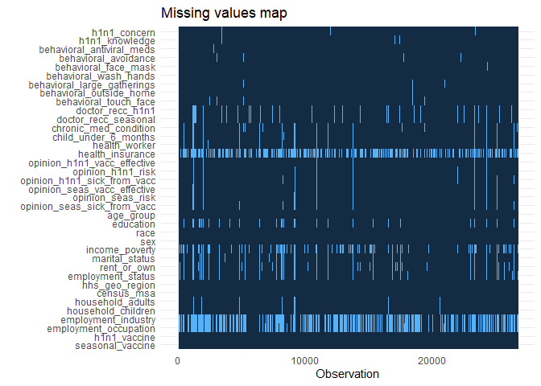
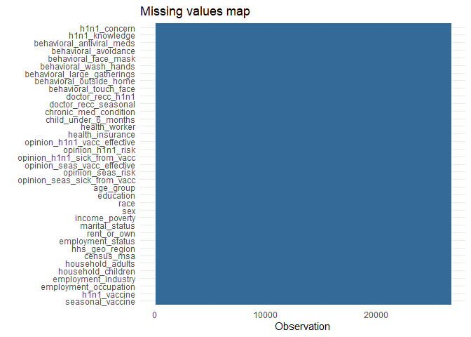

Final Project
================
Chee Kay Cheong

### Load needed packages

``` r
knitr::opts_chunk$set(message = FALSE, warning = FALSE)

library(tidyverse)
library(finalfit)
library(mice)
library(caret)
library(glmnet)
library(randomForest)
library(pROC)
```

# Introduction

Every year, the seasonal flu claims numerous lives across the globe.
This highly contagious virus can spread easily and quickly, causing
severe health complications, especially in people with weakened immune
systems. Vaccinations are essential to prevent illness, and if enough
people receive them, they can create herd immunity, which can help
protect the wider community.

In the spring of 2009, an outbreak of H1N1 influenza, commonly known as
“swine flu,” spread worldwide, causing a death toll estimated to range
from 151,000 to 575,000 in its first year. A vaccine for the H1N1 flu
virus became publicly available in October 2009. Later, in late 2009 and
early 2010, the United States conducted the National 2009 H1N1 Flu
Survey. This phone survey collected personal information from
participants and asked about their social, economic, and demographic
background, views on disease and vaccine efficacy, and steps taken to
reduce the spread of infection. Gaining insights into the relationship
between these characteristics and personal vaccination behavior can help
inform future public health initiatives.

### Research Question

The final project will employ a dataset acquired from
[Kaggle](https://www.kaggle.com/datasets/arashnic/flu-data) that
contains all the survey data gathered. We will use this dataset **to
identify the factors that may influence individuals’ likelihood of
receiving the H1N1 or seasonal flu vaccinations**.

### Rationale for research question

It is essential for public health to recognize the elements that affect
people’s probability to receive the H1N1 or seasonal flu shots for a
variety of reasons:

1.  **Improve disease prevention**
    - Understand what factors influence vaccine uptake can help public
      health officials target their efforts to increase vaccination
      rates and prevent outbreaks.
2.  **Promote health equity**
    - Identifying factors that influence vaccine uptake can help address
      health disparities and ensure that everyone has access to
      vaccines.
    - If certain groups are less likely to get vaccinated due to access
      barriers or mistrust of vaccines, public health officials can work
      to address these issues and increase vaccination rates in those
      populations.
3.  **Reduce economic impact**
    - The flu can have a significant economic impact due to lost of
      productivity, healthcare costs, and other related expenses.
      Increasing vaccination rates and preventing outbreaks can help
      reduce these economic costs and benefit society as a whole.

# Data Preparation

##### Read in and clean dataset.

- Convert all character variables to factor variables.
- Convert the binary outcomes `h1n1_vaccine` and `seasonal_vaccine` from
  numeric to factor variables.

``` r
flu_df = read_csv("./H1N1_Flu_Vaccines.csv") %>% 
  janitor::clean_names() %>% 
  select(-respondent_id) %>% 
  mutate(
    age_group = as_factor(age_group),
    education = as_factor(education),
    race = as_factor(race),
    sex = as_factor(sex),
    income_poverty = as_factor(income_poverty),
    marital_status = as_factor(marital_status),
    rent_or_own = as_factor(rent_or_own),
    employment_status = as_factor(employment_status),
    hhs_geo_region = as_factor(hhs_geo_region),
    census_msa = as_factor(census_msa),
    employment_industry = as_factor(employment_industry),
    employment_occupation = as_factor(employment_occupation),
    h1n1_vaccine = as_factor(h1n1_vaccine),
    seasonal_vaccine = as_factor(seasonal_vaccine))
```

##### Examine missing data.

``` r
missing_plot(flu_df)
```

<!-- -->

Based on the plot above, `health_insurance`, `employment_industry`, and
`employment_occupation` have the most number of missing values. We could
simply remove these three variables, but this may violate the purpose of
our research question. Simply removing these variables with missing
values may introduce bias to our results.

# Impute missing data

Impute missing data using *random forest imputation*.

``` r
impute_missing_data = mice(flu_df, meth = "rf", ntree = 5, m = 2, seed = 100)
flu_nomiss = complete(impute_missing_data)
```

Examine the “new” dataset.

``` r
missing_plot(flu_nomiss)
```

<!-- -->

Based on the plot above, there is no more missing values in the new
dataset `flu_nomiss`. Next, we will perform *Elastic Net* to reduce the
dimension of the dataset by removing features that are not as important
and significant for seasonal and H1N1 vaccines.

# H1N1 vaccines

## Data Partitioning

To understand what variables are responsible for influencing people’s
probability of receiving the H1N1 vaccines, any variables of seasonal
flu will be excluded from this dataset before partitioning.

``` r
set.seed(123)

h1n1 = flu_nomiss %>% 
  select(-seasonal_vaccine, -opinion_seas_vacc_effective, -opinion_seas_risk, -opinion_seas_sick_from_vacc, -doctor_recc_seasonal)

h1n1.train.index = createDataPartition(y = h1n1$h1n1_vaccine, p = 0.7, list = FALSE)
h1n1.train.data = h1n1[h1n1.train.index, ]
h1n1.test.data = h1n1[-h1n1.train.index, ]
```

Examine the number of outcome in the training dataset and determine if
we should do “up” or “down” sampling.

``` r
h1n1.train.data %>% 
  select(h1n1_vaccine) %>% 
  group_by(h1n1_vaccine) %>% 
  count() %>% 
  knitr::kable()
```

| h1n1_vaccine |     n |
|:-------------|------:|
| 0            | 14724 |
| 1            |  3972 |

We should consider upsampling the observations that received the H1N1
vaccine as there are much fewer of them. However, due to the
availability of enough observations to conduct cross-validation and for
the sake of easier computation, we will opt for downsampling instead.

## Feature Selection using Elastic Net

The dataset includes 33 independent variables. To address our research
question, it is necessary to conduct dimension reduction and select the
most relevant features that have the greatest impact on our outcome
variable.

Fit model into H1N1 training set.

``` r
set.seed(123)

# Create vectors of lambda and alpha
lambda = 10^seq(-3, 3, length = 100)
alpha = 0.1*seq(1, 10, length = 10)
tune_grid = expand.grid(alpha = alpha, lambda = lambda)

# Set validation method and options
control.settings = trainControl(method = "cv", number = 10, sampling = "down")

# Fit model 
h1n1_model = train(h1n1_vaccine ~ ., data = h1n1.train.data, method = "glmnet", trControl = control.settings, preProcess = c("center", "scale"), tuneGrid = tune_grid)

# Output best values of alpha & lambda
h1n1_model$bestTune
```

    ##    alpha   lambda
    ## 55   0.1 1.873817

##### Examine model coefficients and variable importance.

``` r
coef(h1n1_model$finalModel, h1n1_model$bestTune$lambda)
```

    ## 90 x 1 sparse Matrix of class "dgCMatrix"
    ##                                                   s1
    ## (Intercept)                             8.216479e-08
    ## h1n1_concern                            .           
    ## h1n1_knowledge                          .           
    ## behavioral_antiviral_meds               .           
    ## behavioral_avoidance                    .           
    ## behavioral_face_mask                    .           
    ## behavioral_wash_hands                   .           
    ## behavioral_large_gatherings             .           
    ## behavioral_outside_home                 .           
    ## behavioral_touch_face                   .           
    ## doctor_recc_h1n1                        9.930267e-03
    ## chronic_med_condition                   .           
    ## child_under_6_months                    .           
    ## health_worker                           .           
    ## health_insurance                        .           
    ## opinion_h1n1_vacc_effective             8.356117e-06
    ## opinion_h1n1_risk                       4.245740e-04
    ## opinion_h1n1_sick_from_vacc             .           
    ## age_group35 - 44 Years                  .           
    ## age_group18 - 34 Years                  .           
    ## age_group65+ Years                      .           
    ## age_group45 - 54 Years                  .           
    ## education12 Years                       .           
    ## educationCollege Graduate               .           
    ## educationSome College                   .           
    ## raceBlack                               .           
    ## raceOther or Multiple                   .           
    ## raceHispanic                            .           
    ## sexMale                                 .           
    ## income_poverty<= $75,000, Above Poverty .           
    ## income_poverty> $75,000                 .           
    ## marital_statusMarried                   .           
    ## rent_or_ownRent                         .           
    ## employment_statusEmployed               .           
    ## employment_statusUnemployed             .           
    ## hhs_geo_regionbhuqouqj                  .           
    ## hhs_geo_regionqufhixun                  .           
    ## hhs_geo_regionlrircsnp                  .           
    ## hhs_geo_regionatmpeygn                  .           
    ## hhs_geo_regionlzgpxyit                  .           
    ## hhs_geo_regionfpwskwrf                  .           
    ## hhs_geo_regionmlyzmhmf                  .           
    ## hhs_geo_regiondqpwygqj                  .           
    ## hhs_geo_regionkbazzjca                  .           
    ## census_msaMSA, Not Principle  City      .           
    ## census_msaMSA, Principle City           .           
    ## household_adults                        .           
    ## household_children                      .           
    ## employment_industryrucpziij             .           
    ## employment_industrywxleyezf             .           
    ## employment_industrysaaquncn             .           
    ## employment_industryxicduogh             .           
    ## employment_industryldnlellj             .           
    ## employment_industrywlfvacwt             .           
    ## employment_industrynduyfdeo             .           
    ## employment_industryfcxhlnwr             .           
    ## employment_industryvjjrobsf             .           
    ## employment_industryarjwrbjb             .           
    ## employment_industryatmlpfrs             .           
    ## employment_industrymsuufmds             .           
    ## employment_industryxqicxuve             .           
    ## employment_industryphxvnwax             .           
    ## employment_industrydotnnunm             .           
    ## employment_industrymfikgejo             .           
    ## employment_industrycfqqtusy             .           
    ## employment_industrymcubkhph             .           
    ## employment_industryhaxffmxo             .           
    ## employment_industryqnlwzans             .           
    ## employment_occupationxtkaffoo           .           
    ## employment_occupationemcorrxb           .           
    ## employment_occupationvlluhbov           .           
    ## employment_occupationxqwwgdyp           .           
    ## employment_occupationccgxvspp           .           
    ## employment_occupationqxajmpny           .           
    ## employment_occupationkldqjyjy           .           
    ## employment_occupationmxkfnird           .           
    ## employment_occupationhfxkjkmi           .           
    ## employment_occupationbxpfxfdn           .           
    ## employment_occupationukymxvdu           .           
    ## employment_occupationcmhcxjea           .           
    ## employment_occupationhaliazsg           .           
    ## employment_occupationdlvbwzss           .           
    ## employment_occupationxzmlyyjv           .           
    ## employment_occupationoijqvulv           .           
    ## employment_occupationrcertsgn           .           
    ## employment_occupationtfqavkke           .           
    ## employment_occupationhodpvpew           .           
    ## employment_occupationuqqtjvyb           .           
    ## employment_occupationpvmttkik           .           
    ## employment_occupationdcjcmpih           .

``` r
varImp(h1n1_model)
```

    ## glmnet variable importance
    ## 
    ##   only 20 most important variables shown (out of 89)
    ## 
    ##                                           Overall
    ## doctor_recc_h1n1                        100.00000
    ## opinion_h1n1_risk                         4.27556
    ## opinion_h1n1_vacc_effective               0.08415
    ## employment_industrywlfvacwt               0.00000
    ## employment_occupationemcorrxb             0.00000
    ## census_msaMSA, Not Principle  City        0.00000
    ## income_poverty<= $75,000, Above Poverty   0.00000
    ## education12 Years                         0.00000
    ## behavioral_antiviral_meds                 0.00000
    ## h1n1_knowledge                            0.00000
    ## employment_occupationdlvbwzss             0.00000
    ## employment_industryatmlpfrs               0.00000
    ## employment_statusEmployed                 0.00000
    ## age_group45 - 54 Years                    0.00000
    ## employment_industrywxleyezf               0.00000
    ## behavioral_wash_hands                     0.00000
    ## household_adults                          0.00000
    ## behavioral_avoidance                      0.00000
    ## employment_occupationbxpfxfdn             0.00000
    ## sexMale                                   0.00000

Based on the model coefficients and variable importance, we identified
three variables that are important for people to receive the H1N1
vaccines:  
1. `doctor_recc_h1n1` - whether the H1N1 flu vaccine was recommended by
doctor.  
2. `opinion_h1n1_risk` - Respondent’s opinion about risk of getting sick
with H1N1 flu without vaccine.  
3. `opinion_h1n1_vacc_effective` - Respondent’s opinion about H1N1
vaccine effectiveness.

### Select only relevant variables for H1N1 training and testing dataset

``` r
# Training set
h1n1_select_train = 
  h1n1.train.data %>% 
  select(doctor_recc_h1n1, opinion_h1n1_risk, opinion_h1n1_vacc_effective, h1n1_vaccine)

# Testing set
h1n1_select_test = 
  h1n1.test.data %>% 
  select(doctor_recc_h1n1, opinion_h1n1_risk, opinion_h1n1_vacc_effective, h1n1_vaccine)
```

## Use Random Forests to test variable importance

Once we have selected the features using *elastic net*, we can use
*random forests* to test the importance of these selected features. We
can fit a random forest model using only the selected features and
compare the resulting variable importance measures to those obtained
from the full model that includes all available features. If the
selected features are indeed important predictors of the outcome, we
should see a similar or higher importance score for these features in
the reduced model compared to the full model. If the selected features
are not important, we would expect their importance scores to be lower
in the reduced model.

Fit model into the reduced training set.

``` r
set.seed(123)

# Try different values of mtry 
mtry.vals.h1n1 = c(ncol(h1n1_select_train)-1, sqrt(ncol(h1n1_select_train)-1), 0.5*ncol(h1n1_select_train)-1)
mtry.grid.h1n1 = expand.grid(.mtry = round(mtry.vals.h1n1))

rf_h1n1 = train(h1n1_vaccine ~ ., data = h1n1_select_train, method = "rf", metric = "Accuracy", tuneGrid = mtry.grid.h1n1, trControl = control.settings, ntree = 100)

rf_h1n1$bestTune
```

    ##   mtry
    ## 1    1

Examine model accuracy and variable importance.

``` r
confusionMatrix(rf_h1n1)
```

    ## Cross-Validated (10 fold) Confusion Matrix 
    ## 
    ## (entries are percentual average cell counts across resamples)
    ##  
    ##           Reference
    ## Prediction    0    1
    ##          0 59.1  5.7
    ##          1 19.7 15.6
    ##                             
    ##  Accuracy (average) : 0.7468

``` r
varImp(rf_h1n1)
```

    ## rf variable importance
    ## 
    ##                             Overall
    ## doctor_recc_h1n1            100.000
    ## opinion_h1n1_risk             5.694
    ## opinion_h1n1_vacc_effective   0.000

The ***random forests*** model gives an average accuracy of 74.68%. The
rank of variable importance for the reduced model is the same as the
full model. The importance of the variable `opinion_h1n1_risk` has
increased, while the importance of the variable
`opinion_h1n1_vacc_effective` has reduced to zero, which indicates the
respondent’s opinion about H1N1 vaccine effectiveness is may not be
important to predict a person’s likelihood of receiving the H1N1
vaccine.

## Evaluate the performance of model on the testing set

``` r
pred.rf.test = predict(rf_h1n1, h1n1_select_test)

test.outcome = h1n1_select_test$h1n1_vaccine

confusionMatrix(pred.rf.test, test.outcome, positive = '1')
```

    ## Confusion Matrix and Statistics
    ## 
    ##           Reference
    ## Prediction    0    1
    ##          0 4804  451
    ##          1 1505 1251
    ##                                           
    ##                Accuracy : 0.7558          
    ##                  95% CI : (0.7463, 0.7652)
    ##     No Information Rate : 0.7875          
    ##     P-Value [Acc > NIR] : 1               
    ##                                           
    ##                   Kappa : 0.4049          
    ##                                           
    ##  Mcnemar's Test P-Value : <2e-16          
    ##                                           
    ##             Sensitivity : 0.7350          
    ##             Specificity : 0.7615          
    ##          Pos Pred Value : 0.4539          
    ##          Neg Pred Value : 0.9142          
    ##              Prevalence : 0.2125          
    ##          Detection Rate : 0.1562          
    ##    Detection Prevalence : 0.3440          
    ##       Balanced Accuracy : 0.7482          
    ##                                           
    ##        'Positive' Class : 1               
    ## 

After applying the model to the reduced test set, the accuracy increased
to 75.62%. The model also showed a balanced sensitivity (0.73) and
specificity (0.76).

# Seasonal Flu vaccines

## Data Partitioning

To understand what variables are responsible for influencing people’s
probability of receiving the seasonal flu vaccines, any variables of
H1N1 will be excluded from this dataset before partitioning.

``` r
set.seed(123)

seasonal = flu_nomiss %>% 
  select(-h1n1_vaccine, -opinion_h1n1_vacc_effective, -opinion_h1n1_risk, -opinion_h1n1_sick_from_vacc, -doctor_recc_h1n1)

seasonal.train.index = createDataPartition(y = seasonal$seasonal_vaccine, p = 0.7, list = FALSE)
seasonal.train.data = seasonal[seasonal.train.index, ]
seasonal.test.data = seasonal[-seasonal.train.index, ]
```

Examine the number of outcome in the training dataset and determine if
we should do “up” or “down” sampling.

``` r
seasonal.train.data %>% 
  select(seasonal_vaccine) %>% 
  group_by(seasonal_vaccine) %>% 
  count() %>% 
  knitr::kable()
```

| seasonal_vaccine |    n |
|:-----------------|-----:|
| 0                | 9991 |
| 1                | 8705 |

The outcome is quite balance, so we might not need any up- or
downsampling.

## Feature Selection using Elastic Net

The dataset includes 33 independent variables. To address our research
question, it is necessary to conduct dimension reduction and select the
most relevant features that have the greatest impact on our outcome
variable.

Fit model into seasonal flu training set.

``` r
set.seed(123)

# Create vectors of lambda and alpha
lambda = 10^seq(-3, 3, length = 100)
alpha = 0.1*seq(1, 10, length = 10)
tune_grid = expand.grid(alpha = alpha, lambda = lambda)

# Set validation method and options
control.settings = trainControl(method = "cv", number = 10)

# Fit model 
seasonal_model = train(seasonal_vaccine ~ ., data = seasonal.train.data, method = "glmnet", trControl = control.settings, preProcess = c("center", "scale"), tuneGrid = tune_grid)

# Output best values of alpha & lambda
seasonal_model$bestTune
```

    ##     alpha      lambda
    ## 611   0.7 0.004037017

##### Examine model coefficients and variable importance.

``` r
coef(seasonal_model$finalModel, seasonal_model$bestTune$lambda)
```

    ## 90 x 1 sparse Matrix of class "dgCMatrix"
    ##                                                    s1
    ## (Intercept)                             -0.1977188566
    ## h1n1_concern                             .           
    ## h1n1_knowledge                           0.1065423341
    ## behavioral_antiviral_meds                0.0049771678
    ## behavioral_avoidance                     .           
    ## behavioral_face_mask                    -0.0003397911
    ## behavioral_wash_hands                    0.0131742075
    ## behavioral_large_gatherings              .           
    ## behavioral_outside_home                 -0.0079852403
    ## behavioral_touch_face                    0.0872261586
    ## doctor_recc_seasonal                     0.5772937259
    ## chronic_med_condition                    0.0713613698
    ## child_under_6_months                     0.0155693755
    ## health_worker                            0.1873961659
    ## health_insurance                         0.1544946353
    ## opinion_seas_vacc_effective              0.5808387007
    ## opinion_seas_risk                        0.7020208114
    ## opinion_seas_sick_from_vacc             -0.2451983205
    ## age_group35 - 44 Years                  -0.1413614249
    ## age_group18 - 34 Years                  -0.2260511923
    ## age_group65+ Years                       0.3495854962
    ## age_group45 - 54 Years                  -0.0988063561
    ## education12 Years                        .           
    ## educationCollege Graduate                0.0650317161
    ## educationSome College                    .           
    ## raceBlack                               -0.0826405414
    ## raceOther or Multiple                    .           
    ## raceHispanic                            -0.0112654441
    ## sexMale                                  .           
    ## income_poverty<= $75,000, Above Poverty  .           
    ## income_poverty> $75,000                  0.0214721835
    ## marital_statusMarried                    0.0292830667
    ## rent_or_ownRent                         -0.0661840579
    ## employment_statusEmployed                .           
    ## employment_statusUnemployed             -0.0179611854
    ## hhs_geo_regionbhuqouqj                   .           
    ## hhs_geo_regionqufhixun                   .           
    ## hhs_geo_regionlrircsnp                  -0.0182367210
    ## hhs_geo_regionatmpeygn                   0.0091917907
    ## hhs_geo_regionlzgpxyit                  -0.0049605575
    ## hhs_geo_regionfpwskwrf                   0.0046790040
    ## hhs_geo_regionmlyzmhmf                  -0.0003735697
    ## hhs_geo_regiondqpwygqj                  -0.0263970655
    ## hhs_geo_regionkbazzjca                   0.0056754985
    ## census_msaMSA, Not Principle  City       0.0149827834
    ## census_msaMSA, Principle City            .           
    ## household_adults                        -0.0002560077
    ## household_children                      -0.0572552655
    ## employment_industryrucpziij             -0.0829111158
    ## employment_industrywxleyezf              .           
    ## employment_industrysaaquncn             -0.0153637344
    ## employment_industryxicduogh              .           
    ## employment_industryldnlellj             -0.0122994952
    ## employment_industrywlfvacwt              .           
    ## employment_industrynduyfdeo              .           
    ## employment_industryfcxhlnwr              0.0501203518
    ## employment_industryvjjrobsf             -0.0303747719
    ## employment_industryarjwrbjb              0.0683027919
    ## employment_industryatmlpfrs              0.0030206465
    ## employment_industrymsuufmds              0.0212628002
    ## employment_industryxqicxuve             -0.0121545356
    ## employment_industryphxvnwax              .           
    ## employment_industrydotnnunm              0.0041501297
    ## employment_industrymfikgejo              0.0486813842
    ## employment_industrycfqqtusy              .           
    ## employment_industrymcubkhph             -0.0002353013
    ## employment_industryhaxffmxo              0.1134046746
    ## employment_industryqnlwzans              .           
    ## employment_occupationxtkaffoo            .           
    ## employment_occupationemcorrxb            0.0011147432
    ## employment_occupationvlluhbov            .           
    ## employment_occupationxqwwgdyp            .           
    ## employment_occupationccgxvspp            .           
    ## employment_occupationqxajmpny           -0.0690358732
    ## employment_occupationkldqjyjy            .           
    ## employment_occupationmxkfnird            .           
    ## employment_occupationhfxkjkmi            0.0132354627
    ## employment_occupationbxpfxfdn           -0.0007800304
    ## employment_occupationukymxvdu           -0.0053538647
    ## employment_occupationcmhcxjea            0.0205175500
    ## employment_occupationhaliazsg            .           
    ## employment_occupationdlvbwzss            0.0001325376
    ## employment_occupationxzmlyyjv            0.0062502555
    ## employment_occupationoijqvulv           -0.0021113173
    ## employment_occupationrcertsgn            .           
    ## employment_occupationtfqavkke            .           
    ## employment_occupationhodpvpew            0.0020474868
    ## employment_occupationuqqtjvyb           -0.0305528677
    ## employment_occupationpvmttkik            .           
    ## employment_occupationdcjcmpih            0.0673988419

``` r
varImp(seasonal_model)
```

    ## glmnet variable importance
    ## 
    ##   only 20 most important variables shown (out of 89)
    ## 
    ##                               Overall
    ## opinion_seas_risk             100.000
    ## opinion_seas_vacc_effective    82.738
    ## doctor_recc_seasonal           82.233
    ## age_group65+ Years             49.797
    ## opinion_seas_sick_from_vacc    34.928
    ## age_group18 - 34 Years         32.200
    ## health_worker                  26.694
    ## health_insurance               22.007
    ## age_group35 - 44 Years         20.136
    ## employment_industryhaxffmxo    16.154
    ## h1n1_knowledge                 15.177
    ## age_group45 - 54 Years         14.075
    ## behavioral_touch_face          12.425
    ## employment_industryrucpziij    11.810
    ## raceBlack                      11.772
    ## chronic_med_condition          10.165
    ## employment_occupationqxajmpny   9.834
    ## employment_industryarjwrbjb     9.729
    ## employment_occupationdcjcmpih   9.601
    ## rent_or_ownRent                 9.428

Based on the model coefficients and variable importance, we decided to
select variables that have an overall importance of 20% or higher:  
1. `opinion_seas_risk` - Respondent’s opinion about risk of getting sick
with seasonal flu without vaccine.  
2. `opinion_seas_vacc_effective` - Respondent’s opinion about seasonal
flu vaccine effectiveness.  
3. `doctor_recc_seasonal` - Whether seasonal flu vaccine was recommended
by doctor. 4. `age_group` - Age group of respondent.  
5. `opinion_seas_sick_from_vacc` - Respondent’s worry of getting sick
from taking seasonal flu vaccine.  
6. `health_worker` - Whether respondent is a healthcare worker. 7.
`health_insurance` - Whether respondent has health insurance.

### Select only relevant variables for seasonal flu training and testing dataset

``` r
# Training set
seasonal_select_train = 
  seasonal.train.data %>% 
  select(opinion_seas_risk, opinion_seas_vacc_effective, doctor_recc_seasonal, age_group, opinion_seas_sick_from_vacc, health_worker, health_insurance, seasonal_vaccine)

# Testing set
seasonal_select_test = 
  seasonal.test.data %>% 
  select(opinion_seas_risk, opinion_seas_vacc_effective, doctor_recc_seasonal, age_group, opinion_seas_sick_from_vacc, health_worker, health_insurance, seasonal_vaccine)
```

## Use Random Forests to test variable importance

Once we have selected the features using *elastic net*, we can use
*random forests* to test the importance of these selected features. We
can fit a random forest model using only the selected features and
compare the resulting variable importance measures to those obtained
from the full model that includes all available features. If the
selected features are indeed important predictors of the outcome, we
should see a similar or higher importance score for these features in
the reduced model compared to the full model. If the selected features
are not important, we would expect their importance scores to be lower
in the reduced model.

Fit model into the reduced training set.

``` r
set.seed(123)

# Try different values of mtry 
mtry.vals.seasonal = c(ncol(seasonal_select_train)-1, sqrt(ncol(seasonal_select_train)-1), 0.5*ncol(seasonal_select_train)-1)
mtry.grid.seasonal = expand.grid(.mtry = round(mtry.vals.seasonal))

rf_seasonal = train(
  seasonal_vaccine ~ ., data = seasonal_select_train, method = "rf", metric = "Accuracy", tuneGrid = mtry.grid.seasonal, trControl = control.settings, ntree = 100)

rf_seasonal$bestTune
```

    ##   mtry
    ## 1    3

Examine model accuracy and variable importance.

``` r
confusionMatrix(rf_seasonal)
```

    ## Cross-Validated (10 fold) Confusion Matrix 
    ## 
    ## (entries are percentual average cell counts across resamples)
    ##  
    ##           Reference
    ## Prediction    0    1
    ##          0 43.1 12.2
    ##          1 10.4 34.3
    ##                             
    ##  Accuracy (average) : 0.7739

``` r
varImp(rf_seasonal)
```

    ## rf variable importance
    ## 
    ##                             Overall
    ## opinion_seas_risk           100.000
    ## opinion_seas_vacc_effective  96.913
    ## doctor_recc_seasonal         86.387
    ## age_group65+ Years           29.498
    ## opinion_seas_sick_from_vacc  13.940
    ## age_group18 - 34 Years       11.827
    ## health_insurance             11.182
    ## health_worker                 9.315
    ## age_group35 - 44 Years        1.678
    ## age_group45 - 54 Years        0.000

The ***random forests*** model gives an average accuracy of 77.39%. The
rank of variable importance for the reduced model is quite similar the
full model. The importance of the variable `opinion_seas_vacc_effective`
has increased, while the importance of the variables
`doctor_recc_seasonal` has decreased a little bit. People in the age
group of 65+ years are more likely to receive a seasonal flu vaccines
compared to other age groups. The importance of all other variables that
were selected has dropped to below 20%, which indicates maybe they are
not important variables that influence people’s probability of receiving
seasonal flu vaccines.

## Evaluate the performance of model on the testing set

``` r
pred.rf.seasonal = predict(rf_seasonal, seasonal_select_test)

test.outcome.seasonal = seasonal_select_test$seasonal_vaccine

confusionMatrix(pred.rf.seasonal, test.outcome.seasonal, positive = '1')
```

    ## Confusion Matrix and Statistics
    ## 
    ##           Reference
    ## Prediction    0    1
    ##          0 3416  960
    ##          1  865 2770
    ##                                           
    ##                Accuracy : 0.7722          
    ##                  95% CI : (0.7628, 0.7813)
    ##     No Information Rate : 0.5344          
    ##     P-Value [Acc > NIR] : < 2e-16         
    ##                                           
    ##                   Kappa : 0.5415          
    ##                                           
    ##  Mcnemar's Test P-Value : 0.02778         
    ##                                           
    ##             Sensitivity : 0.7426          
    ##             Specificity : 0.7979          
    ##          Pos Pred Value : 0.7620          
    ##          Neg Pred Value : 0.7806          
    ##              Prevalence : 0.4656          
    ##          Detection Rate : 0.3458          
    ##    Detection Prevalence : 0.4538          
    ##       Balanced Accuracy : 0.7703          
    ##                                           
    ##        'Positive' Class : 1               
    ## 

After applying the model to the reduced test set, the accuracy of the
model remained about the same (77.24%). The model also showed a balanced
sensitivity (0.74) and specificity (0.80).

## Analytic Limitation

## Ethical Consideration
